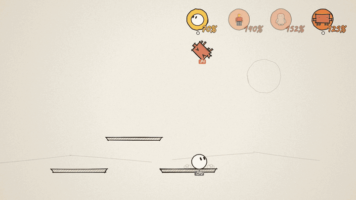

# Supa Smackdown

A hand-drawn, Smash-style fighting game in the browser, starring the internet's mascots: Claw'd, Grok Bot, Wumpus, Android,
Duo, Snoo, Lego Man and Muse. Every fighter fights with its own app. Duo pop-quizzes you, Wumpus blasts the soundboard airhorn,
Android sends the Chrome dino leaping out, and Lego Man builds stairs out of studs.

**[▶ Play it in your browser](https://mbranni03.github.io/smackdown/)**. Nothing to install.

[](https://mbranni03.github.io/smackdown/)

## What's in it

- **8 fighters**, each with a full moveset of brand-themed moves. Every move is storyboarded on the [characters page](https://mbranni03.github.io/smackdown/pages/moves.html).
- **Up to 4 at once**: pick 1–3 CPUs, free-for-all or teams.
- **CPUs at 7 levels**, from beginner up to "AI trained".
- **Smash-style rules**: damage %, knockback, 3 stocks, shields, grabs, dodges and ledges.
- **Sound design**: all synthesized with Web Audio, with no audio files. Brand moves play sound-alikes of their app's own sounds,
  like Discord's ping, Duolingo's "correct" ding and Tesla's Autopilot chime.
- **Background music**: an original synthesized loop, soft in the menus and the full groove in a fight. Set its volume on the
  menus' **music** row.
- **Rebindable controls**, with two key sets live at once (saved in a cookie).

## Controls

|                                      | Keys 1     | Keys 2 |
| ------------------------------------ | ---------- | ------ |
| Move                                 | W A S D    | Arrows |
| Jump                                 | Space      | Space  |
| Light / heavy attack                 | J / K      | C / X  |
| Special                              | L          | V      |
| Grab                                 | I          | G      |
| Dodge (hold on the ground to shield) | Left Shift | Z      |

Esc pauses. Double-tap down to fast fall. Rebind anything under **controls**. On the **music** row, ← → set the volume
(Enter or a click steps it, through off).

## Run it locally

It's static files with no build step. Serve the folder and open http://localhost:8123:

```sh
python3 -m http.server 8123
```

`node tools/cpu-check.js` plays every CPU against every other one headless, as a regression check.

## Where things are

- `index.html`: the engine (physics, moves, camera, menus, rendering)
- `src/characters/`: each fighter's drawing (`<name>.js`) and moveset (`<name>-moveset.js`)
- `src/cpu.js`: the CPU brains
- `src/sfx.js`: the sound
- `src/sketch.js`: the pencil-on-paper look
- `pages/moves.html`: the moves page

---

A fan project, not affiliated with or endorsed by the companies behind these mascots. Their names and characters are their
owners' trademarks.
